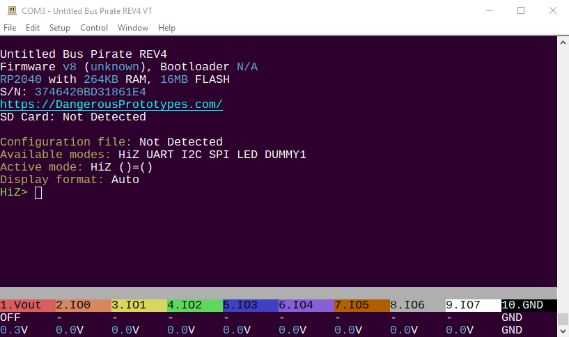

# Bus Pirate 5

Bus Pirate 5 is the latest edition of the universal serial interface trusted by hackers since 2008.

Can't get a chip to work? Is it the circuit, code, bad part or a burned out pin? The Bus Pirate sends commands over common serial protocols (1-Wire, I2C, SPI, UART, MIDI, serial LEDs, etc) so you can get to know a chip before prototyping. Updated with tons of new features, talking to chips and probing interfaces is more fun than ever!

## Resources

- [Firmware documentation](https://firmware.buspirate.com/) ([source](https://github.com/DangerousPrototypes/BusPirate5-docs-firmware))
- [Hardware documentation](https://hardware.buspirate.com/) ([source](https://github.com/DangerousPrototypes/BusPirate5-docs-hardware))
- [Get help and chat in the forum](https://forum.buspirate.com/)

## VT100 terminal interface

VT100 terminal emulation supports color and a live statusbar view of the voltage and functions on each pin. Type simple commands into the terminal, the Bus Pirate translates them into popular serial protocols and displays the response. Learn how a chip works without touching a line of code.

## Specifications

- Raspberry Pi RP2040 with 128Mbit program flash
- 8 powerful IO pins - Support multiple protocols from 1.2-5volts. Analog voltage measurement and optional 10K pull-ups on all pins
- 1-5volt output power supply - 0-500mA current limit, current sense, resettable fuse and protection circuit
- 1Gbit NAND flash - Store settings and files. Appears as a USB drive.
- LCD - A beautiful 240x320 pixel color IPS (all angle viewing) LCD acts as a pin label, while also showing the voltage on each pin and the current consumption of the programmable power supply unit
- 18 RGB LEDs - It's customary to have an indicator LED, so to check that box we added 16 SK6812 RGB LEDs.
- Just one button - 18 party LEDs but just one button!
- 1-Wire, I2C, SPI, UART, MIDI, serial LEDs supported, more to come!

Bus Pirate 5 is the universal serial interface tool designed by hackers, for hackers. It's crammed full of hardware and firmware features to make probing chips pleasant and easy.